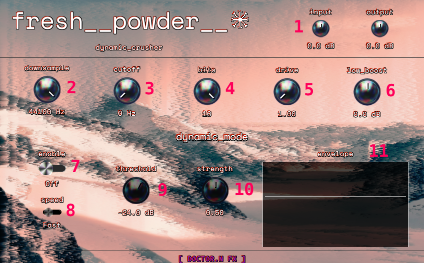

# FRESH POWDER - A DYNAMIC, HYBRID BITCRUSHER

This is a live web demo of fresh_powder! Check it out at https://doctornfx.github.io/fresh_powder-web/

**A dynamic bitcrusher and lo-fi audio effect plugin**



Fresh Powder combines classic sample rate reduction (downsampling) and bit depth reduction with frequency-split processing and dynamic envelope modulation. Create everything from subtle lo-fi warmth to extreme digital destruction—with intelligent bass preservation and real-time dynamic control.

---

## Features

- **Bitcrushing**: Reduce bit depth from 16 bits down to 1 bit
- **Downsampling**: Reduce sample rate from 44.1kHz down to 200Hz
- **Frequency Split Processing**: Keep your bass clean while crushing the highs
- **Saturation**: Add harmonic warmth to the crushed signal
- **Dynamic Mode**: Envelope follower modulates the effect intensity based on your input signal
- **Real-time Visualization**: See exactly when and how the dynamic processing engages

Available as **VST3** and **CLAP** plugins, or try the **web demo** in your browser.

---

## Controls

### 1. Input & Output Knobs

**Input** (top-left) and **Output** (top-right) control the gain before and after processing.

| Knob | Range | Purpose |
|------|-------|---------|
| **Input** | -24 dB to +24 dB | Boost weak signals or tame hot signals before they hit the effect |
| **Output** | -24 dB to +24 dB | Compensate for level changes introduced by the processing |

**Tip**: If your source is quiet, boost the Input to get more signal into the effect. If the output is too loud or distorted, reduce the Output gain.

---

### 2. Downsample Knob

**Range**: 200 Hz – 44,100 Hz

The Downsample control reduces the effective sample rate of your audio. Lower values create that classic "stepped" lo-fi sound by holding each sample for longer periods.

| Setting | Character |
|---------|-----------|
| 44,100 Hz | Clean (no downsampling) |
| 10,000 Hz | Subtle lo-fi coloring |
| 4,000 Hz | Noticeable degradation, telephone-like |
| 1,000 Hz | Heavy aliasing, retro digital |
| 200 Hz | Extreme destruction |

**Dynamic Indicator**: When Dynamic Mode is enabled, a gray arc appears on this knob showing the *actual* current downsample rate as it responds to your input signal.

---

### 3. Cutoff Knob

**Range**: 0 Hz – 10,000 Hz

The Cutoff control sets the frequency where the signal is split. Everything *below* this frequency passes through clean; everything *above* gets crushed.

| Setting | Effect |
|---------|--------|
| 0 Hz | No split; entire signal is processed |
| 100 Hz | Sub-bass stays clean, everything else crushed |
| 500 Hz | Bass preserved, mids and highs crushed |
| 2,000 Hz | Low-mids preserved, upper-mids and highs crushed |

**Tip**: Start around 100–200 Hz to keep your kick drum and bass punchy while adding lo-fi character to everything else.

---

### 4. Bits Knob

**Range**: 1 – 16 bits

The Bits control sets the quantization depth for the crushed portion of your signal. Lower bit depths create more obvious digital artifacts and reduce dynamic range.

| Setting | Character |
|---------|-----------|
| 16 bits | CD quality (imperceptible) |
| 12 bits | Light quantization noise |
| 8 bits | Getting there... |
| 4 bits | Now we're in retro game console territory |
| 1 bit | Extreme! |

**Tip**: Combine low bit settings with the Cutoff control to keep your bass smooth while adding grit to the highs. A reminder: this processing is only applied to frequencies above the cutoff setting.

---

### 5. Drive Knob

**Range**: 1.0 – 10.0

The Drive control adds soft-clipping saturation to the high-frequency component (after the frequency split). This introduces harmonic content and gentle compression.

| Setting | Effect |
|---------|--------|
| 1.0 | No saturation (bypass) |
| 2.0 – 3.0 | Subtle warmth and harmonic enhancement |
| 4.0 – 6.0 | Noticeable saturation and compression |
| 7.0 – 10.0 | Heavy distortion, aggressive tone |

**Tip**: Higher drive settings pair well with lower bit depths for that "broken speaker" aesthetic.

---

### 6. Low Boost Knob

**Range**: -10 dB to +10 dB

The Low Boost control adjusts the gain of the clean bass signal (the portion below the Cutoff frequency). Use it to compensate when heavy crushing makes your sound feel thin.

| Setting | Effect |
|---------|--------|
| -10 dB | Reduce bass presence |
| 0 dB | Unity gain (no change) |
| +10 dB | Boost bass to compensate for heavy crushing |

**Tip**: When using aggressive Downsample and Bits settings, add a few dB of Low Boost to maintain weight in your low end.

---

## Dynamic Mode

The Dynamic section allows the downsampling intensity to respond to your input signal level. Louder moments get more aggressive crushing; quieter moments stay cleaner.

### 7. Enable Toggle

Turns Dynamic Mode on or off.

- **Off**: Downsample rate stays constant at the knob setting
- **On**: Downsample rate is modulated by the envelope follower

---

### 8. Speed Toggle

Controls how quickly the envelope follower responds to level changes.

| Mode | Attack | Release | Character |
|------|--------|---------|-----------|
| **Fast** | 5 ms | 50 ms | Snappy, responsive—follows transients closely |
| **Slow** | 50 ms | 250 ms | Smooth, sustained—gradual modulation |

**Tip**: Use **Fast** for drums and percussive material where you want the effect to pump with each hit. Use **Slow** for pads and sustained sounds for smoother modulation - try "slow" on a guitar signal!

---

### 9. Threshold Knob

**Range**: -60 dB to 0 dB

Sets the level at which Dynamic Mode begins to engage. Signal below the threshold won't trigger dynamic modulation.

| Setting | Behavior |
|---------|----------|
| -60 dB | Extremely sensitive—even quiet signals trigger modulation |
| -30 dB | Moderate—normal playing levels trigger modulation |
| -12 dB | Less sensitive—only louder moments trigger modulation |
| 0 dB | Only the loudest peaks trigger modulation |

**Tip**: Set the threshold just below your average signal level for consistent dynamic response. Watch the Envelope Graph to fine-tune. Experiment a bit - some signals sound best with the threshold set below the lowest signal you see in the graph; others sound better with just the highest peaks creeping over the top of the threshold.

---

### 10. Strength Knob

**Range**: 0.0 – 1.0

Controls how aggressively the envelope modulates the downsample rate when the signal exceeds the threshold.

| Setting | Effect |
|---------|--------|
| 0.0 | No dynamic effect (even if enabled) |
| 0.3 | Subtle pumping |
| 0.6 | Noticeable dynamic crushing |
| 1.0 | Maximum intensity. Most signals dramatically reduce the sample rate |

**Tip**: Start around 0.3–0.5 and increase until you hear the effect pumping with your material.

---

### 11. Envelope Graph

The real-time visualization shows the input signal level over the last 5 seconds.

| Element | Meaning |
|---------|---------|
| **Gray horizontal line** | Current Threshold setting |
| **Gray segments** | Signal below threshold (no dynamic effect) |
| **White segments with orange shadow** | Signal above threshold (dynamic crushing active) |

Use this graph to:
- **Set your Threshold**: Adjust until the white segments appear on the peaks you want to affect
- **Monitor activity**: See exactly when the dynamic processing is engaging
- **Dial in Strength**: Watch how your signal interacts with the threshold as you adjust

---

## Quick Start Recipes

### Subtle Lo-Fi Warmth
- Downsample: 7,000 Hz
- Cutoff: 150 Hz
- Bits: 12
- Drive: 2.0
- Low Boost: +2 dB
- Dynamic: Off

### Pumping Drums
- Downsample: 6,000 Hz
- Cutoff: 100 Hz
- Bits: 8
- Drive: 3.0
- Low Boost: +4 dB
- Dynamic: On
- Speed: Fast
- Threshold: -24 dB (or just below the lowest level seen in graph)
- Strength: 0.6

### Extreme Destruction
- Downsample: 1,000 Hz
- Cutoff: 80 Hz
- Bits: 4
- Drive: 8.0
- Low Boost: +6 dB
- Dynamic: On
- Speed: Fast
- Threshold: -40 dB
- Strength: 1.0

### Telephone Effect
- Downsample: 4,000 Hz
- Cutoff: 0 Hz (no split)
- Bits: 8
- Drive: 4.0
- Low Boost: 0 dB
- Dynamic: Off

---

## Signal Flow

```
Input Audio
    │
    ▼
┌─────────────────┐
│   Input Gain    │
└────────┬────────┘
         │
         ▼
┌─────────────────┐
│ Envelope Detect │──────────────┐
└────────┬────────┘              │
         │                       │ (modulates downsample
         ▼                       │  when Dynamic is on)
┌─────────────────┐              │
│ Frequency Split │              │
│    (Cutoff)     │              │
└────────┬────────┘              │
    ┌────┴──────────┐            │
    │               │            │
    ▼               ▼            │
┌───────┐                        │
│ Lows  │         Highs          │
│       │           ▼            │
│  ┌────┴────┐  ┌────────┐       │
│  │Low Boost│  │ Drive  │       │
│  └────┬────┘  └───┬────┘       │
│       │           │            │
│       │      ┌────┴─────┐      │
│       │      │Downsample│◄─────┘
│       │      └────┬─────┘ 
│       │           │      
│       │      ┌────┴────┐ 
│       │      │  Bits   │ 
│       │      └────┬────┘ 
└───────┘           │      
    │               │      
    └───────┬───────┘      
            │              
            ▼              
    ┌───────────────┐      
    │      Mix      │      
    └───────┬───────┘      
            │
            ▼
    ┌───────────────┐
    │  Output Gain  │
    └───────┬───────┘
            │
            ▼
      Output Audio
```

---

## Installation

### Plugin (VST3/CLAP)

1. Download the latest release for your platform
2. Copy the plugin file to your DAW's plugin folder:
   - **Windows VST3**: `C:\Program Files\Common Files\VST3\`
   - **Windows CLAP**: `C:\Program Files\Common Files\CLAP\`
   - **macOS VST3**: `/Library/Audio/Plug-Ins/VST3/`
   - **macOS CLAP**: `/Library/Audio/Plug-Ins/CLAP/`
   - **Linux VST3**: `~/.vst3/`
   - **Linux CLAP**: `~/.clap/`
3. Rescan plugins in your DAW
4. Insert Fresh Powder on a track and enjoy

### Web Demo

Visit the web demo to try Fresh Powder directly in your browser—no installation required. The web demo has identical functionality to the plugin.

---

## Credits

**Fresh Powder** by Doctor.N FX

Built with [NIH-plug](https://github.com/robbert-vdh/nih-plug) and [egui](https://github.com/emilk/egui).
